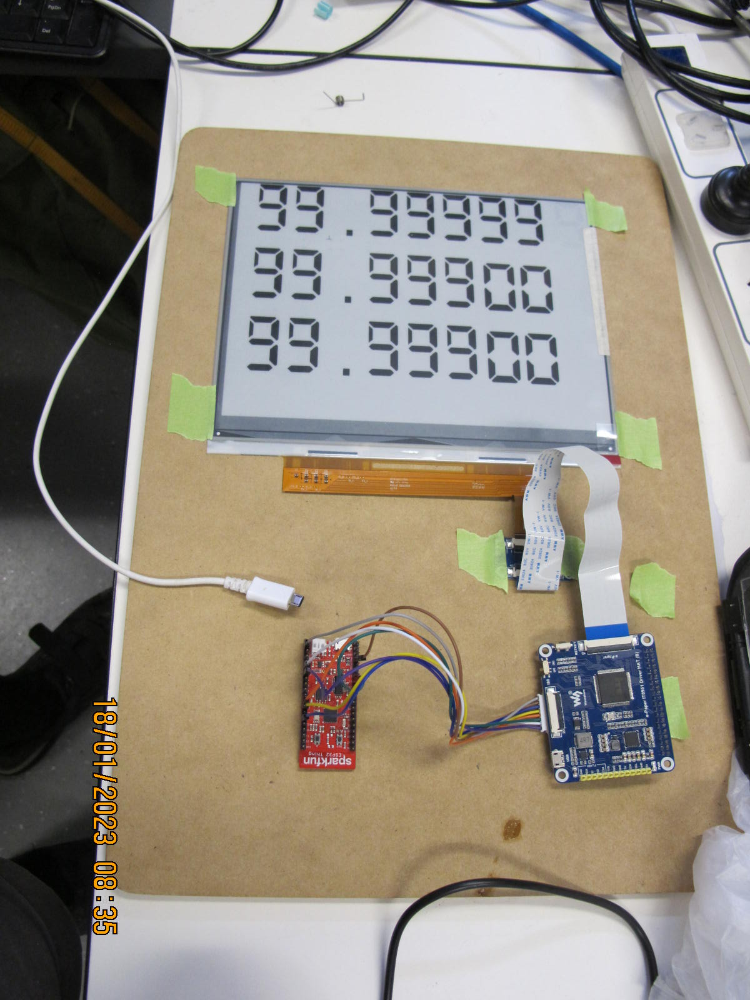
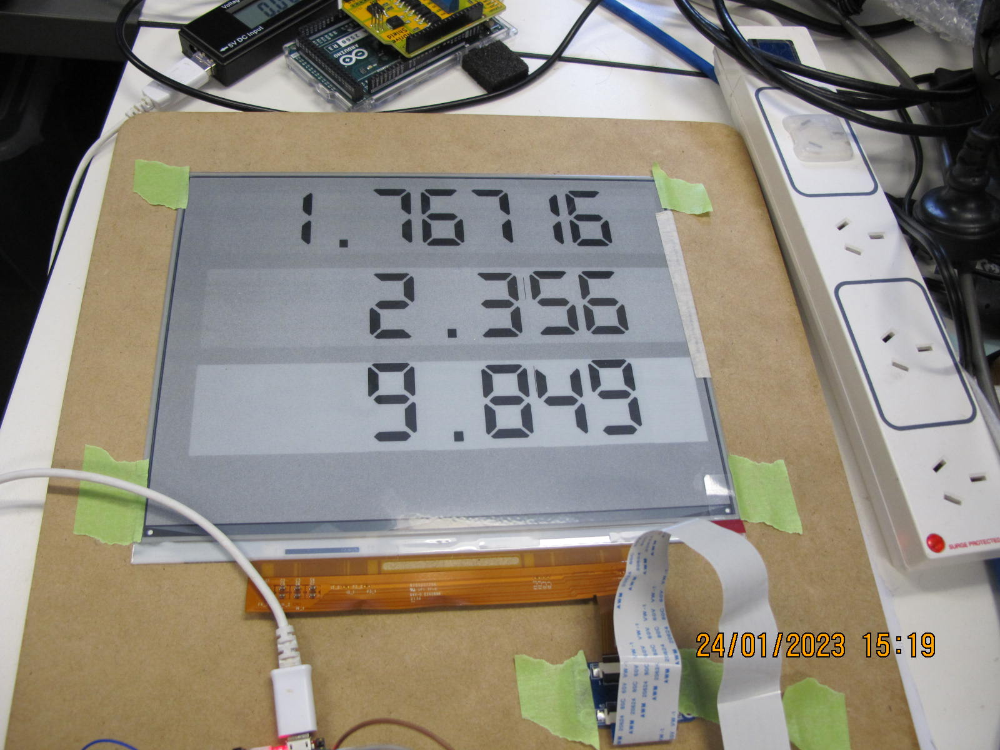
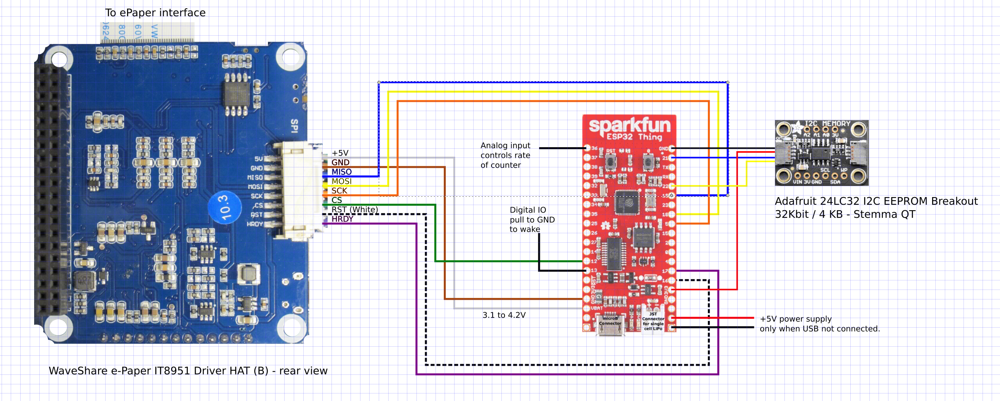

# Display Digits on Waveshare E-Paper-IT8951-Driver-Hat using Sparkfun ESP32 Thing

epaper_simple is a simple arduino application to display digits on E-Paper.

epaper_complex is closer to being a final application with extra features.

Both rely heavily on the example code gleaned from https://github.com/clashman/it8951

I have converted that code for development using the standard Arduino IDE.
The objective was to display three rows of numbers which would be retentive when the ESP32 is off or in sleep mode.
The ten digits and a decimal place and blank character are stored as individual images in the form of header files in the ESP32 program memory.
## The Waveshare E-Paper IT8951 Driver Hat
For our project we are using this driver board with the 10.3" e-paper screen, which comes with the IT8951 display hat.

This hat simplifies the display by buffering the data through memory, but unfortunately the current firmware doesn't appear to allow for any off-screen memory, so all images must be stored initally on the controling device
The hat is intended for the Raspberry Pi, but works just as well through an SPI interface on an ESP32.

We used the ESP32 as it restarts and shutsdown reliably and has a light sleep mode that allows for immediate recovery. For the final project we also added a Adafruit EEPROM so that data can be retained if the power is completely lost.
As an added bonus, the Sparkfun ESP32 Thing comes with a Lipo battery interface which we will charge using a hand crank generator.
### Display modes
The driver board has a number of display modes described in https://www.waveshare.com/w/upload/c/c4/E-paper-mode-declaration.pdf.

For epaper_complex, set the variable drawMode to one of the following defines before using the display_buffer function.
INIT_Mode = the contents of the buffer are ignored and the epaper is returned to white for the defined area. Unfortunately, the buffer must still match the size of the area.
DU_Mode = very fast display mode
GC16_Mode = strong display mode good for refresh
//A2_Mode's value is not fixed, is decide by firmware's LUT 
A2_Mode  = fast display mode  (value true true for 10.3" https://www.waveshare.com/wiki/6inch_HD_e-Paper_HAT )

I didn't bother with any of the grey scale options.

While the INIT_Mode can made the screen very white, it doesn't say white. For the ESP32, it can only do the display_clear is two goes, with the result that the first half starts to go grey before the second half has finished.

Changing any sub-area will effect other areas.

In the end, I only used GC16_Mode to occassionally refresh the digits and A2_Mode for normal changes.  The A2 mode leaves white ghosts when part of a digit is cleared and so a clearing cycle using GC16 mode is required occasionally.

Note that in any mode, the X axis must align with the edges of 32 bits. Since I am using 8 pixels per bytes, that means the display address and width of the area being modified must be a multipul of 4. Strange things happen otherwise.
## Hookup
Here is the wiring for both the epaper_simple and epaper_complex.

Note: The eeprom and the two inputs on pins GPIO_NUM_13 and A0 are only required for epaper_complex.
## Digits
The digits are all seperate images saved as PROGMEM arrays. They were created by converting BMP files saved in a directory then using the command line: py -3 convert1bpp.py -b 128

The convert1bpp.py is included in this repository. It converts every BMP file it finds in that directory.

The BMP file must be one byte per pixel grey scale. The -b option sets the threshold to convert the image to Black and White.
## Sleep Modes
In epaper_simple, I've used the Adafruit library "Adafruit_SleepyDog" which can be installed in the Arduino IDE using the library manager.

In epaper_complex, I moved to the esp_light_sleep_start function which allows for hardware interupt.

The IT8951 display hat has a hardware selected sleep input.

By physically disabling the power leds on all boards, the sleep mode power was greatly reduced.
## ToDo
I did attempt encoding the digits using Run Length Encoding to save memory but the each digit would need to be decompressed on the fly, so wasn't worth the effort.
## Conclusion
For applications which require a large display and extremely low power, the Waveshare 10.3inch e-Paper Display Hat is one of the few options available for quick prototyping.

It wouldn't be suitable for applications requiring fast full screen refresh unless the white ghosting effect could be tolerated.
Further tweaking of the IT8951.cpp code might get better results.

